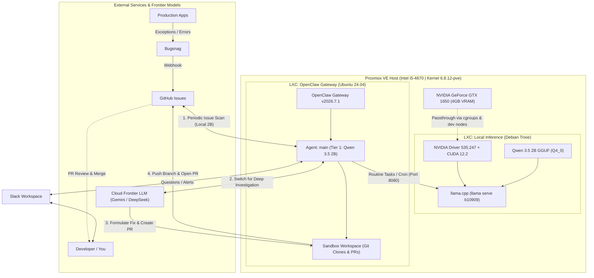

## 💡 Introduction: Repurposing Budget Silicon for 24/7 AI

Like many homelab enthusiasts, I had a modest PC powered by an older 4th-gen Intel Core i5-4670 and an NVIDIA GeForce GTX 1650 (4 GB VRAM) that spent years faithfully handling media transcoding and light tasks. But as local LLMs matured in 2026, an intriguing vision took shape: 

> **Could an entry-level 4GB GPU power an always-on, 24/7 autonomous software engineer in my homelab—without incurring eye-watering cloud API bills or sluggish roundtrips?**

### 🎯 The Dream: Autonomous Issue Triage & Bug Fixing

In my day-to-day development, most of my apps report runtime errors and exceptions to **Bugsnag**. Whenever an incident occurs, Bugsnag triggers a webhook that automatically opens a **GitHub Issue** in the corresponding repository. 

Previously, that issue would sit in a backlog waiting for manual triage. Now, **OpenClaw** takes over:

1. **Scheduled Monitoring (Local Qwen 3.5 2B):** OpenClaw runs on a periodic schedule to scan my GitHub account for newly opened issues and handle routine heartbeat tasks. Because this runs 24/7 at high frequency, executing it locally costs $0 in API bills.
2. **Switching to Cloud for Investigation:** Once a real issue is detected, OpenClaw **switches the active investigation to a frontier cloud model** (such as Gemini Flash or DeepSeek). This provides the massive reasoning bandwidth needed to analyze deep stack traces, multi-file codebases, and complex architecture dependencies.
3. **Autonomous Repository Setup:** The agent automatically clones the repository into its local workspace sandbox if it isn't already present.
4. **Smart Triage & Escalation:** If the issue requires business logic decisions, credentials, or human clarification, OpenClaw pings me directly in **Slack** with a concise brief.
5. **Auto-Fix & Pull Request:** If the problem is self-contained (e.g., edge-case null checks, unhandled exceptions, or validation bugs), the agent diagnoses the root cause, writes the fix, runs tests, and **submits a clean Pull Request**.
6. **Human-in-the-Loop Review:** All I have to do is review the proposed PR on GitHub and hit Approve or Reject.

### ⚖️ The Best of Both Worlds: Hybrid Local + Cloud Tiering

Running continuous 24/7 agent loops, cron triggers, heartbeats, and frequent polling against commercial cloud LLMs would burn hundreds of thousands of tokens each week just doing routine housekeeping. 

Conversely, relying *only* on a 2B local parameter model to perform deep architectural refactoring across a large production codebase would stretch its limits.

The solution is a **two-tiered hybrid setup**:
- **Tier 1 (Local GTX 1650 + Qwen 3.5 2B):** Always-on, ultra-fast (50+ tok/s), zero-cost gatekeeper handling cron jobs, GitHub issue polling, and routine simple tasks.
- **Tier 2 (Cloud Model Escalation):** Dynamically invoked when an investigation starts, handling deep code reading, test generation, and complex bug patching.

Here is the complete blueprint of how it all works.

---

## 🏗️ Architecture & End-to-End Pipeline

Rather than running a heavyweight Virtual Machine (VM) with dedicated PCIe passthrough—which locks hardware resources and adds virtualization overhead—we leverage **dual Proxmox LXC containers**. Containers share the host Linux kernel directly, offering near-native GPU compute performance and instantaneous boot times.



### Hardware & Environment Specs
- **Host CPU:** Intel Core i5-4670 @ 3.40 GHz (4 cores)
- **Host Kernel:** Proxmox VE `6.8.12-11-pve`
- **GPU:** NVIDIA GeForce GTX 1650 (TU117, 4096 MiB VRAM)
- **LXC (`llm`):** Debian Trixie (testing), 4 GB RAM, NVIDIA Driver `535.247.01`
- **LXC (`claw`):** Ubuntu 24.04 LTS, 16 GB RAM, Node.js `v24.18.0`, OpenClaw Gateway

---

## 🚀 Step 1: Passing the GTX 1650 to Debian Trixie LXC

In an LXC container, GPU passthrough is achieved by sharing the host's NVIDIA character devices (`/dev/nvidia*`) and configuring cgroup access control permissions.

### 1. Host Driver & Device Identification
Ensure the host has the NVIDIA proprietary drivers installed and the open-source Nouveau driver disabled in `/etc/modprobe.d/nvidia-installer-disable-nouveau.conf`:

```ini
blacklist nouveau
options nouveau modeset=0
```

Verify the character device major and minor numbers on the host:

```bash
ls -l /dev/nvidia*
# crw-rw-rw- 1 root root 195,   0 ... /dev/nvidia0
# crw-rw-rw- 1 root root 195, 255 ... /dev/nvidiactl
# crw-rw-rw- 1 root root 195, 254 ... /dev/nvidia-modeset
# crw-rw-rw- 1 root root 234,   0 ... /dev/nvidia-uvm
# crw-rw-rw- 1 root root 234,   1 ... /dev/nvidia-uvm-tools
```

In our setup, the major numbers are `195` (NVIDIA core/control/modeset) and `234` (NVIDIA Unified Virtual Memory / UVM).

### 2. Proxmox LXC Configuration (`/etc/pve/lxc/<CTID>.conf`)
Open the container configuration file on the Proxmox host (e.g., `/etc/pve/lxc/100.conf`) and append the cgroup allowances and device mount entries:

```ini
arch: amd64
cores: 4
features: nesting=1
hostname: llm
memory: 4096
net0: name=eth0,bridge=vmbr0,firewall=1,gw=192.168.1.1,ip=192.168.1.50/24,type=veth
ostype: debian
rootfs: local-lvm:vm-100-disk-0,size=32G
swap: 4096
unprivileged: 0

# --- NVIDIA GPU Passthrough ---
lxc.cgroup2.devices.allow: c 195:* rwm
lxc.cgroup2.devices.allow: c 234:* rwm
lxc.cgroup2.devices.allow: c 240:* rwm
lxc.cgroup2.devices.allow: c 226:* rwm

lxc.mount.entry: /dev/nvidia0 dev/nvidia0 none bind,optional,create=file
lxc.mount.entry: /dev/nvidiactl dev/nvidiactl none bind,optional,create=file
lxc.mount.entry: /dev/nvidia-modeset dev/nvidia-modeset none bind,optional,create=file
lxc.mount.entry: /dev/nvidia-uvm dev/nvidia-uvm none bind,optional,create=file
lxc.mount.entry: /dev/nvidia-uvm-tools dev/nvidia-uvm-tools none bind,optional,create=file
lxc.mount.entry: /dev/nvidia-caps/nvidia-cap1 dev/nvidia-caps/nvidia-cap1 none bind,optional,create=file
lxc.mount.entry: /dev/nvidia-caps/nvidia-cap2 dev/nvidia-caps/nvidia-cap2 none bind,optional,create=file
lxc.mount.entry: /dev/dri/card1 dev/dri/card1 none bind,optional,create=file
lxc.mount.entry: /dev/dri/renderD128 dev/dri/renderD128 none bind,optional,create=file
```

> [!TIP]
> Setting `unprivileged: 0` (a privileged container) avoids complex UID/GID namespace mappings for `/dev/nvidia*` devices, making GPU passthrough straightforward.

### 3. In-Container Driver Setup (Debian Trixie)
Start the container and install the matching userspace libraries in Debian Trixie:

```bash
apt update
apt install -y nvidia-driver firmware-misc-nonfree
```

Verify that the GPU is accessible inside the container:

```bash
nvidia-smi
```

Output:
```text
+---------------------------------------------------------------------------------------+
| NVIDIA-SMI 535.247.01             Driver Version: 535.247.01   CUDA Version: 12.2     |
|-----------------------------------------+----------------------+----------------------+
| GPU  Name                 Persistence-M | Bus-Id        Disp.A | Volatile Uncorr. ECC |
| Fan  Temp   Perf          Pwr:Usage/Cap |         Memory-Usage | GPU-Util  Compute M. |
|=========================================+======================+======================|
|   0  NVIDIA GeForce GTX 1650        On  | 00000000:01:00.0 Off |                  N/A |
| 71%   82C    P0              67W /  75W |   2930MiB /  4096MiB |    100%      Default |
+-----------------------------------------+----------------------+----------------------+
```

---

## ⚡ Step 2: Serving Qwen 3.5 2B via llama.cpp

### Why Qwen 3.5 2B?
For agentic workflows on an entry-level 4GB GPU, **Qwen 3.5 2B** is an extraordinary match:
- **Compact Footprint:** At 4-bit quantization (`Q4_0`), the entire model takes just **~1.2 GB**.
- **Reasoning Tokens:** It natively supports `<think>` reasoning tags, making tool selection and logic planning robust.
- **Native Tool Calling:** Excellent instruction following for tool invocation and schema compliance.
- **Enormous Context:** Supports up to 262k native training context, easily running at **65,536 tokens** context locally with Flash Attention.

### 1. Installing `llama.cpp`
We install the latest `llama` standalone binary directly via the official script:

```bash
curl -LsSf https://llama.app/install.sh | sh
echo 'export PATH="$HOME/.local/bin:$PATH"' >> ~/.bash_profile
source ~/.bash_profile
```

### 2. Launching the Inference Server
Run `llama serve` pointing directly to the Hugging Face GGUF repository with Flash Attention enabled:

```bash
llama serve \
  -hf unsloth/Qwen3.5-2B-GGUF:Q4_0 \
  --host 0.0.0.0 \
  --port 8080 \
  --parallel 1 \
  -c 65536 \
  --flash-attn on
```

> [!IMPORTANT]
> The `--flash-attn on` flag is vital. On a 4GB card, allocating a 64k unoptimized KV cache would instantly trigger an Out-of-Memory (OOM) error. With Flash Attention, memory consumption remains under **~2.93 GB**, leaving over **1 GB of VRAM headroom**!

---

## 📊 Performance Benchmarks: GTX 1650 in Action

We benchmarked the server using an OpenAI-compatible completion call against `http://192.168.1.50:8080/completion`:

| Metric | Result | Notes |
| :--- | :---: | :--- |
| **Model** | `unsloth/Qwen3.5-2B-GGUF:Q4_0` | 1.88B parameters (~1.2 GB disk) |
| **Context Length (`n_ctx`)** | **65,536 tokens** | Full Flash Attention enabled |
| **Decode Throughput** | **50.80 tok/sec** | 19.68 ms per token |
| **Prompt Ingestion Speed** | **47.52 tok/sec** | 21.04 ms per token |
| **Time to First Token (TTFT)** | **~220 ms** | Fast enough for real-time conversational streaming |
| **Total VRAM Utilization** | **2,930 MiB / 4,096 MiB** | ~71.5% utilization on GTX 1650 |

At **50+ tokens per second**, responses feel instantaneous—significantly faster than most cloud LLM streaming rates.

---

## 🤖 Step 3: Configuring the OpenClaw Agent

In the companion container (`claw.local`), we have **OpenClaw Gateway (v2026.7.1)** running as a systemd user service.

### 1. Registering the Local Llama Provider
In `/home/openclaw/.openclaw/openclaw.json`, configure the custom `llama` provider pointing to our LXC inference node on `192.168.1.50:8080`:

```json
{
  "providers": {
    "llama": {
      "apiKey": "llama",
      "api": "openai-completions",
      "baseUrl": "http://192.168.1.50:8080/v1",
      "models": [
        {
          "id": "Qwen3.5-2B-GGUF:Q4_0",
          "name": "Qwen3.5 2B",
          "reasoning": true,
          "input": ["text", "image", "video", "audio"]
        }
      ]
    }
  }
}
```

### 2. Tier 1 Model Definition & Cloud Delegation Policy
Assign `llama/Qwen3.5-2B-GGUF:Q4_0` as the default local driver for routine tasks and cron triggers, while configuring cloud models (like Gemini Flash or DeepSeek) as the investigation and fallback engines:

```json
{
  "agents": {
    "defaults": {
      "model": {
        "primary": "deepseek/deepseek-flash",
        "fallbacks": ["google/gemini-3.8-flash"]
      },
      "subagents": {
        "delegationMode": "prefer"
      }
    },
    "entries": {
      "main": {
        "name": "main",
        "workspace": "/home/openclaw/.openclaw/workspace",
        "model": {
          "primary": "llama/Qwen3.5-2B-GGUF:Q4_0"
        },
        "subagents": {
          "delegationMode": "prefer"
        },
        "tools": {
          "alsoAllow": [
            "agents_list",
            "tts",
            "wiki_status",
            "wiki_lint",
            "wiki_apply"
          ]
        }
      }
    }
  }
}
```

### 3. Channel & Event Binding (Slack + Scheduled Issue Scan)
Link the `main` agent to incoming messages from Slack for human interaction and notification alerts:

```json
{
  "bindings": [
    {
      "agentId": "main",
      "match": {
        "accountId": "main",
        "channel": "slack"
      }
    }
  ]
}
```

### 4. The Autonomous Bug-Fixing Loop in Action
With the configuration complete, here is how OpenClaw executes its two-tier maintenance cycle:

1. **Bugsnag Webhook Trigger:** An unhandled production exception is captured by Bugsnag and forwarded to GitHub, creating an issue with the stack trace and error metadata.
2. **Cron/Scheduled Ingestion (Local Qwen 3.5 2B):** The lightweight local model monitors the GitHub API on a scheduled cron. Because this polling runs 24/7, running it locally incurs zero API cost.
3. **Model Switch on Investigation:** Once a real issue is detected, OpenClaw **delegates the investigation task to a cloud model** (such as Gemini Flash or DeepSeek) using `delegationMode: prefer`.
4. **Workspace Git Clone:** The agent issues a git clone into its isolated sandbox (`/home/openclaw/.openclaw/workspace`) if the repository is not already cached.
5. **Deep Code Analysis & Patching:** The cloud model analyzes the full stack trace, inspects the codebase, runs test scripts, and crafts the fix.
6. **Human Escalation vs. Auto-PR:**
   - **Needs Clarification:** If the issue requires business logic decisions or missing context, OpenClaw pings Slack with a concise query.
   - **Direct Fix:** If self-contained, it creates a dedicated fix branch, pushes to GitHub, and submits a Pull Request.
7. **Final Human Review:** You get a notification with the PR link, perform a quick code review, and merge with confidence.

---

## 📈 Real-World Gateway Logs

Monitoring OpenClaw via `journalctl --user -u openclaw-gateway.service`:

```text
openclaw node[28081]: [model-fetch] start provider=llama api=openai-completions model=Qwen3.5-2B-GGUF:Q4_0 method=POST url=http://192.168.1.50:8080/v1/chat/completions
openclaw node[28081]: [model-fetch] response provider=llama api=openai-completions model=Qwen3.5-2B-GGUF:Q4_0 status=200 elapsedMs=228 dispatcher=reused contentType=text/event-stream
```

Every routine heartbeat and cron turn in the agent loop executes with a **~220ms turnaround**, keeping the system responsive, nimble, and cost-free.

---

## 💡 Key Takeaways & Lessons Learned

1. **The Power of Tiered AI Architecture:** Combining a local 2B model for high-frequency cron checks and simple tasks with cloud frontier models for deep investigation gives the ultimate sweet spot: **$0 wasted on idle loops, and maximum reasoning power when tackling code fixes**.
2. **LXC > Heavy VMs for Homelab AI:** Passing `/dev/nvidia*` into an LXC avoids dedicating whole PCIe slots, allows instantaneous container reboots, and preserves CPU cycles for other tasks.
3. **Flash Attention is a Game Changer for 4GB GPUs:** Without Flash Attention, a 4GB GTX 1650 would run out of memory on even moderate context sizes. With Flash Attention, 65k context runs comfortably inside 2.9GB VRAM.
4. **The 2B Class Has Arrived:** Qwen 3.5 2B is fast, capable, and light enough to turn aging desktop hardware into a reliable, always-on homelab copilot.
