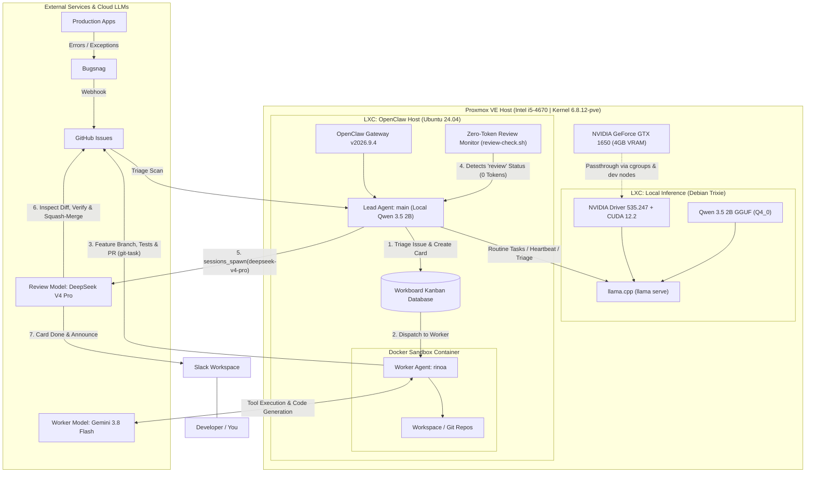

## 💡 Introduction: Repurposing Budget Silicon for 24/7 AI

Like many homelab enthusiasts, I had a modest PC powered by an older 4th-gen Intel Core i5-4670 and an NVIDIA GeForce GTX 1650 (4 GB VRAM) that spent years faithfully handling media transcoding and light tasks. But as local LLMs matured in 2026, an intriguing vision took shape: 

> **Could an entry-level 4GB GPU power an always-on, 24/7 autonomous software engineer in my homelab—without incurring eye-watering cloud API bills or sluggish roundtrips?**

### 🎯 The Dream: Autonomous Issue Triage, Worker Dispatch & Code Review

In my day-to-day development, most of my apps report runtime errors and exceptions to **Bugsnag**. Whenever an incident occurs, Bugsnag triggers a webhook that automatically opens a **GitHub Issue** in the corresponding repository. 

Previously, that issue would sit in a backlog waiting for manual triage, fixing, and review. Now, an **autonomous multi-agent pipeline powered by OpenClaw** takes over:

1. **Scheduled Triage (Local Qwen 3.5 2B):** OpenClaw's `main` agent runs on a periodic schedule to scan GitHub for newly opened issues and handle routine heartbeat tasks. Because this runs 24/7 at high frequency, executing it locally on our GTX 1650 costs **$0 in API bills**.
2. **Workboard Kanban Dispatch:** `main` creates a card on OpenClaw's internal Workboard in the `ready` column and assigns it to **`rinoa`**—a dedicated worker agent running in an isolated Docker sandbox container powered by **Gemini 3.8 Flash**.
3. **Atomic Feature Branching & Fixes (`git-task`):** `rinoa` claims the card (`in_progress`), checks out a feature branch (`fix/issue-<num>-<slug>`), diagnoses the root cause, writes code, runs unit/integration tests, and submits a Pull Request via GitHub CLI (`gh pr create`). Pushing directly to `main` is strictly forbidden.
4. **Zero-Token Idle Review Monitoring:** When `rinoa` completes her run, the card enters the `review` column. To avoid burning API credits polling cloud models 24/7, a lightweight local shell pre-check monitors the Workboard. If no cards are in review, it exits in 10ms with **zero API calls and zero token cost**.
5. **Frontier Subagent Delegation (`deepseek/deepseek-v4-pro`):** Once a card reaches `review`, `main` spawns a dedicated code review subagent via `sessions_spawn` configured with a frontier reasoning model (**DeepSeek V4 Pro**).
6. **Autonomous Code Review & Merge:** The frontier subagent inspects the diff (`gh pr diff`), validates test passes and security, and either:
   - **Approves & Merges:** Runs `gh pr review --approve`, merges via `gh pr merge --squash --delete-branch`, moves the Workboard card to `done`, and notifies Slack.
   - **Requests Changes:** Leaves line-by-line feedback on the PR, moves the card back to `ready` for `rinoa` to revise, and alerts Slack.

### ⚖️ The Best of Both Worlds: Three-Tier Hybrid Architecture

Running continuous 24/7 agent loops, cron triggers, heartbeats, and frequent polling against commercial cloud LLMs would burn millions of tokens each week just doing routine housekeeping. Conversely, relying *only* on a 2B local parameter model to review complex code changes or write multi-file features stretches small models beyond their limit.

The solution is a **three-tiered hybrid setup**:
- **Tier 1 — Local Orchestrator (GTX 1650 + Qwen 3.5 2B):** Always-on, ultra-fast (50+ tok/s), zero-cost gatekeeper handling cron jobs, GitHub issue triage, and workboard dispatching.
- **Tier 2 — Sandboxed Coding Worker (`rinoa` + Gemini 3.8 Flash):** Rapid execution engine inside Docker with full compiler/test tool access, implementing feature branches and opening PRs.
- **Tier 3 — Frontier Review Subagent (`deepseek/deepseek-v4-pro`):** On-demand frontier reasoning invoked strictly when a PR is waiting for review, performing rigorous diff analysis, approving, and squash-merging.

Here is the complete blueprint of how it all works.

---

## 🏗️ Architecture & End-to-End Pipeline

Rather than running a heavyweight Virtual Machine (VM) with dedicated PCIe passthrough—which locks hardware resources and adds virtualization overhead—we leverage **dual Proxmox LXC containers**. Containers share the host Linux kernel directly, offering near-native GPU compute performance and instantaneous boot times.



### Hardware & Environment Specs
- **Host CPU:** Intel Core i5-4670 @ 3.40 GHz (4 cores)
- **Host Kernel:** Proxmox VE `6.8.12-11-pve`
- **GPU:** NVIDIA GeForce GTX 1650 (TU117, 4096 MiB VRAM)
- **LXC (`llm`):** Debian Trixie (testing), 4 GB RAM, NVIDIA Driver `535.247.01`
- **LXC (`claw`):** Ubuntu 24.04 LTS, 16 GB RAM, Node.js `v24.18.0`, OpenClaw Gateway `v2026.9.4`

---

## 🚀 Step 1: Passing the GTX 1650 to Debian Trixie LXC

In an LXC container, GPU passthrough is achieved by sharing the host's NVIDIA character devices (`/dev/nvidia*`) and configuring cgroup access control permissions.

### 1. Host Driver & Device Identification
Ensure the host has the NVIDIA proprietary drivers installed and the open-source Nouveau driver disabled in `/etc/modprobe.d/nvidia-installer-disable-nouveau.conf`:

```ini
blacklist nouveau
options nouveau modeset=0
```

Verify the character device major and minor numbers on the host:

```bash
ls -l /dev/nvidia*
# crw-rw-rw- 1 root root 195,   0 ... /dev/nvidia0
# crw-rw-rw- 1 root root 195, 255 ... /dev/nvidiactl
# crw-rw-rw- 1 root root 195, 254 ... /dev/nvidia-modeset
# crw-rw-rw- 1 root root 234,   0 ... /dev/nvidia-uvm
# crw-rw-rw- 1 root root 234,   1 ... /dev/nvidia-uvm-tools
```

In our setup, the major numbers are `195` (NVIDIA core/control/modeset) and `234` (NVIDIA Unified Virtual Memory / UVM).

### 2. Proxmox LXC Configuration (`/etc/pve/lxc/<CTID>.conf`)
Open the container configuration file on the Proxmox host (e.g., `/etc/pve/lxc/100.conf`) and append the cgroup allowances and device mount entries:

```ini
arch: amd64
cores: 4
features: nesting=1
hostname: <your-hostname>
memory: 4096
net0: name=eth0,bridge=vmbr0,firewall=1,gw=<GATEWAY_IP>,ip=192.168.1.x/24,type=veth
ostype: debian
rootfs: local-lvm:vm-XXX-disk-0,size=32G
swap: 4096
unprivileged: 0

# --- NVIDIA GPU Passthrough ---
lxc.cgroup2.devices.allow: c 195:* rwm
lxc.cgroup2.devices.allow: c 234:* rwm
lxc.cgroup2.devices.allow: c 240:* rwm
lxc.cgroup2.devices.allow: c 226:* rwm

lxc.mount.entry: /dev/nvidia0 dev/nvidia0 none bind,optional,create=file
lxc.mount.entry: /dev/nvidiactl dev/nvidiactl none bind,optional,create=file
lxc.mount.entry: /dev/nvidia-modeset dev/nvidia-modeset none bind,optional,create=file
lxc.mount.entry: /dev/nvidia-uvm dev/nvidia-uvm none bind,optional,create=file
lxc.mount.entry: /dev/nvidia-uvm-tools dev/nvidia-uvm-tools none bind,optional,create=file
lxc.mount.entry: /dev/nvidia-caps/nvidia-cap1 dev/nvidia-caps/nvidia-cap1 none bind,optional,create=file
lxc.mount.entry: /dev/nvidia-caps/nvidia-cap2 dev/nvidia-caps/nvidia-cap2 none bind,optional,create=file
lxc.mount.entry: /dev/dri/card1 dev/dri/card1 none bind,optional,create=file
lxc.mount.entry: /dev/dri/renderD128 dev/dri/renderD128 none bind,optional,create=file
```

> [!TIP]
> Setting `unprivileged: 0` (a privileged container) avoids complex UID/GID namespace mappings for `/dev/nvidia*` devices, making GPU passthrough straightforward.

### 3. In-Container Driver Setup (Debian Trixie)
Start the container and install the matching userspace libraries in Debian Trixie:

```bash
apt update
apt install -y nvidia-driver firmware-misc-nonfree
```

Verify that the GPU is accessible inside the container:

```bash
nvidia-smi
```

Output:
```text
+---------------------------------------------------------------------------------------+
| NVIDIA-SMI 535.247.01             Driver Version: 535.247.01   CUDA Version: 12.2     |
|-----------------------------------------+----------------------+----------------------+
| GPU  Name                 Persistence-M | Bus-Id        Disp.A | Volatile Uncorr. ECC |
| Fan  Temp   Perf          Pwr:Usage/Cap |         Memory-Usage | GPU-Util  Compute M. |
|=========================================+======================+======================|
|   0  NVIDIA GeForce GTX 1650        On  | 00000000:01:00.0 Off |                  N/A |
| 71%   82C    P0              67W /  75W |   2930MiB /  4096MiB |    100%      Default |
+-----------------------------------------+----------------------+----------------------+
```

---

## ⚡ Step 2: Serving Qwen 3.5 2B via llama.cpp

### Why Qwen 3.5 2B?
For agentic workflows on an entry-level 4GB GPU, **Qwen 3.5 2B** is an extraordinary match:
- **Compact Footprint:** At 4-bit quantization (`Q4_0`), the entire model takes just **~1.2 GB**.
- **Reasoning Tokens:** It natively supports `<think>` reasoning tags, making tool selection and logic planning robust.
- **Native Tool Calling:** Excellent instruction following for tool invocation and schema compliance.
- **Enormous Context:** Supports up to 262k native training context, easily running at **65,536 tokens** context locally with Flash Attention.

### 1. Installing `llama.cpp`
We install the latest `llama` standalone binary directly via the official script:

```bash
curl -LsSf https://llama.app/install.sh | sh
echo 'export PATH="$HOME/.local/bin:$PATH"' >> ~/.bash_profile
source ~/.bash_profile
```

### 2. Launching the Inference Server
Run `llama serve` pointing directly to the Hugging Face GGUF repository with Flash Attention enabled:

```bash
llama serve \
  -hf unsloth/Qwen3.5-2B-GGUF:Q4_0 \
  --host 0.0.0.0 \
  --port 8080 \
  --parallel 1 \
  -c 65536 \
  --flash-attn on
```

> [!IMPORTANT]
> The `--flash-attn on` flag is vital. On a 4GB card, allocating a 64k unoptimized KV cache would instantly trigger an Out-of-Memory (OOM) error. With Flash Attention, memory consumption remains under **~2.93 GB**, leaving over **1 GB of VRAM headroom**!

### 3. Automating on Boot with Systemd
To ensure the inference server starts automatically whenever the container or Proxmox host reboots, create a systemd service unit at `/etc/systemd/system/llama.service`:

```ini
[Unit]
Description=llama.cpp Inference Server (Qwen 3.5 2B)
After=network.target

[Service]
Type=simple
User=root
WorkingDirectory=/root
Environment="HOME=/root"
Environment="PATH=/root/.local/bin:/usr/local/sbin:/usr/local/bin:/usr/sbin:/usr/bin:/sbin:/bin"
ExecStart=/root/.local/bin/llama serve -hf unsloth/Qwen3.5-2B-GGUF:Q4_0 --host 0.0.0.0 --port 8080 --parallel 1 -c 65536 --flash-attn on
Restart=always
RestartSec=5
StandardOutput=journal
StandardError=journal

[Install]
WantedBy=multi-user.target
```

Reload systemd, enable the service on boot, and start it:

```bash
systemctl daemon-reload
systemctl enable llama.service
systemctl start llama.service
```

You can view real-time inference and server logs at any time using `journalctl`:

```bash
# Follow logs in real-time
journalctl -u llama -f

# View the last 100 log lines
journalctl -u llama -n 100 --no-pager
```

---

## 📊 Performance Benchmarks: GTX 1650 in Action

We benchmarked the server using an OpenAI-compatible completion call against `http://192.168.1.x:8080/completion`:

| Metric | Result | Notes |
| :--- | :---: | :--- |
| **Model** | `unsloth/Qwen3.5-2B-GGUF:Q4_0` | 1.88B parameters (~1.2 GB disk) |
| **Context Length (`n_ctx`)** | **65,536 tokens** | Full Flash Attention enabled |
| **Decode Throughput** | **50.80 tok/sec** | 19.68 ms per token |
| **Prompt Ingestion Speed** | **47.52 tok/sec** | 21.04 ms per token |
| **Time to First Token (TTFT)** | **~220 ms** | Fast enough for real-time conversational streaming |
| **Total VRAM Utilization** | **2,930 MiB / 4,096 MiB** | ~71.5% utilization on GTX 1650 |

At **50+ tokens per second**, responses feel instantaneous—significantly faster than most cloud LLM streaming rates.

---

## 🤖 Step 3: Configuring the OpenClaw Agent

In the companion container (`claw-host.local`), we have **OpenClaw Gateway (v2026.7.1)** running as a systemd user service.

### 1. Registering the Local Llama Provider
In `/home/openclaw/.openclaw/openclaw.json`, configure the custom `llama` provider pointing to our LXC inference node on `192.168.1.x:8080`:

```json
{
  "providers": {
    "llama": {
      "apiKey": "llama",
      "api": "openai-completions",
      "baseUrl": "http://192.168.1.x:8080/v1",
      "models": [
        {
          "id": "Qwen3.5-2B-GGUF:Q4_0",
          "name": "Qwen3.5 2B",
          "reasoning": true,
          "input": ["text", "image", "video", "audio"]
        }
      ]
    }
  }
}
```

### 2. Multi-Agent Setup & Frontier Delegation Policy
In OpenClaw `v2026.9.4`, we establish a specialized multi-agent hierarchy:
- **`main`:** The local lead orchestrator, triaging GitHub issues and managing the Workboard on `llama/Qwen3.5-2B-GGUF:Q4_0`.
- **`rinoa`:** The autonomous coding worker, isolated inside a Docker sandbox container with Java, Node.js, and git tooling, powered by `google/gemini-3.8-flash`.
- **Frontier Review Subagent:** Dynamically spawned by `main` via `sessions_spawn` with `deepseek/deepseek-v4-pro` solely when PRs are ready for code review.

Here is the relevant snippet from `/home/openclaw/.openclaw/openclaw.json`:

```json
{
  "agents": {
    "defaults": {
      "modelPolicy": {
        "allow": [
          "deepseek/deepseek-v4-pro",
          "deepseek/deepseek-flash",
          "deepseek/*",
          "google/gemini-3.8-flash",
          "ollama-cloud/gpt-oss:120b",
          "llama/*"
        ]
      }
    },
    "entries": {
      "main": {
        "name": "main",
        "workspace": "/home/openclaw/.openclaw/workspace",
        "model": {
          "primary": "llama/Qwen3.5-2B-GGUF:Q4_0",
          "fallbacks": [
            "ollama-cloud/gpt-oss:120b",
            "deepseek/deepseek-flash",
            "google/gemini-3.8-flash"
          ]
        },
        "tools": {
          "alsoAllow": [
            "sessions_spawn",
            "sessions_yield",
            "subagents",
            "message",
            "workboard_list",
            "workboard_create",
            "workboard_complete",
            "workboard_move"
          ]
        }
      },
      "rinoa": {
        "name": "rinoa",
        "workspace": "/home/openclaw/.openclaw/workspace-rinoa",
        "model": {
          "primary": "google/gemini-3.8-flash"
        },
        "sandbox": {
          "mode": "all",
          "backend": "docker",
          "docker": {
            "image": "openclaw-rinoa:trixie-slim"
          }
        }
      }
    }
  }
}
```

### 3. Atomic Feature Branching & PR Workflow (`git-task`)
To enforce strict repository safety, agents are **never allowed to commit or push directly to `main`**. We equip the worker with an atomic skill script (`git-task`):

```bash
# 1. Check out fresh feature branch
git-task start --repo allensandiego/tutorai --issue 3 --name "db-timeout-fix"

# 2. Worker edits code and validates tests in sandbox...

# 3. Commit, push branch, open PR, comment on issue, and advance Workboard in 1 single turn
git-task submit-pr \
  --repo allensandiego/tutorai \
  --issue 3 \
  --title "fix(db): increase connection pool timeout" \
  --summary "Resolved connection pool starvation under concurrent load." \
  --verify "All unit and integration tests passing"
```

This ensures every code change is cleanly branched as `fix/issue-<num>-<slug>`, pushed to origin, and opened as a GitHub Pull Request linking back to the original issue.

---

### 4. Zero-Token Idle Review Architecture

A naive approach to code review would be scheduling a background job running a frontier cloud model (like DeepSeek V4 Pro or Claude) every 5 minutes to check for pending PRs. However, this is a major anti-pattern: **the cloud LLM would wake up 288 times a day just to inspect an empty board, burning API credits 24/7 for zero work.**

Instead, we designed a **Zero-Token Idle Pre-Check** (`~/.openclaw/scripts/review-check.sh`):

```bash
#!/usr/bin/env bash
export PATH=/home/openclaw/.nvm/versions/node/v24.18.0/bin:$PATH

# Query local SQLite workboard (100% free, 0 tokens, ~10ms execution)
CARDS_JSON=$(openclaw workboard list --status review --json 2>/dev/null || echo '{"cards":[]}')
COUNT=$(echo "$CARDS_JSON" | jq '.cards | length' 2>/dev/null || echo 0)

if [ "$COUNT" -eq 0 ]; then
  # Queue is empty. Exit immediately with zero API calls.
  exit 0
fi

# Only when PRs are waiting, wake main to spawn the frontier review subagent:
openclaw agent --agent main --message "Workboard Alert: $COUNT card(s) in review.
Spawn a review subagent with model 'deepseek/deepseek-v4-pro' to review diff, test, and merge if approved."
```

We register this script as a recurring command automation in OpenClaw (`--every 5m --command "sh -lc ~/.openclaw/scripts/review-check.sh"`):
- **When Idle (99% of the time):** A 10ms local SQLite query executes. **Cost: $0.00 / 0 tokens.**
- **When a PR is Ready:** It triggers **once**, prompting `main` to spawn the frontier reviewer.

---

### 5. Autonomous Code Review & Merge in Action

When `main` receives the review alert, it calls `sessions_spawn`:

```json
{
  "model": "deepseek/deepseek-v4-pro",
  "label": "PR Review #3",
  "task": "Review Pull Request #3 in allensandiego/tutorai:\n1. Run 'gh pr diff 3' to inspect all changes.\n2. Verify requirements, architecture standards, and test suites.\n3. If approved: approve via 'gh pr review --approve', merge via 'gh pr merge --squash --delete-branch', and complete the card.\n4. If changes requested: leave detailed comments via 'gh pr review --request-changes' and move card back to 'ready'."
}
```

The frontier subagent executes the full review with deep reasoning, verifies test suites, squash-merges the PR to `main`, deletes the feature branch, and announces the successful deployment to Slack.

---

## 📈 Real-World Gateway Logs

Monitoring local triage runs via `journalctl --user -u openclaw-gateway.service`:

```text
openclaw node[42165]: [model-fetch] start provider=llama api=openai-completions model=Qwen3.5-2B-GGUF:Q4_0 method=POST url=http://192.168.0.245:8080/v1/chat/completions
openclaw node[42165]: [model-fetch] response provider=llama api=openai-completions model=Qwen3.5-2B-GGUF:Q4_0 status=200 elapsedMs=214 dispatcher=reused contentType=text/event-stream
```

Every routine heartbeat and GitHub triage turn executes with a **~210ms turnaround**, keeping the system responsive, nimble, and completely free of cloud token usage.

---

## 💡 Key Takeaways & Lessons Learned

1. **Three-Tier AI Architecture is Optimal:** 
   - **Local 2B (`Qwen 3.5 2B`):** 24/7 zero-cost triage, polling, and dispatch.
   - **Sandboxed Worker (`Gemini 3.8 Flash`):** Fast, large-context implementation inside Docker.
   - **Frontier Subagent (`DeepSeek V4 Pro`):** On-demand, high-reasoning code review and merge.
2. **Never Poll with Cloud LLMs:** Always use command-based local pre-checks (`payload: { kind: "command" }`) against local state/SQLite before invoking paid APIs. Zero-token idle keeps cloud bills strictly tied to real deliverables.
3. **Atomic Tooling Enforces Clean Git Hygiene:** Equipping agents with scripts like `git-task` prevents messy commit histories, protects `main`, and automates PR creation and issue linking in a single turn.
4. **Flash Attention on Budget GPUs Works:** Running Qwen 3.5 2B with Flash Attention on an entry-level GTX 1650 provides 65k context at 50+ tok/s while consuming under 3 GB VRAM.
