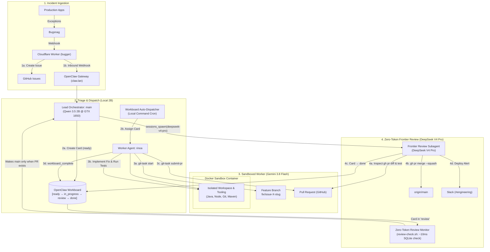

## 💡 The Autonomous Engineering Dream

In modern software operations, observability tools like **Bugsnag** capture exceptions the millisecond they happen in production or staging. Through webhooks, these alerts are automatically converted into **GitHub Issues**, complete with stack traces, breadcrumbs, and device metadata.

Traditionally, this is where the automation stops. An engineer must still:
1. Notice the ticket.
2. Clone the repo and check out a branch.
3. Diagnose the stack trace.
4. Write the fix and run tests.
5. Submit a Pull Request.
6. Have another engineer review the diff and merge it into `main`.

What if an autonomous AI agent team handled steps 1 through 6 end-to-end—safely, reliably, and without burning hundreds of dollars in cloud API bills while idle?

With **OpenClaw (v2026.9.4)**, we built a production-grade, multi-agent engineering pipeline that does exactly that.

---

## 🏗️ Architecture & End-to-End Pipeline

A monolithic AI agent trying to do everything inside a single continuous chat session quickly hits fatal bottlenecks: context bloat, token exhaustion, rate limits, and lack of role separation. 

Instead, we organize our agents into a **three-tier specialized hierarchy** managed through an internal Kanban **Workboard**:



---

## 🎯 The Three Tiers Explained

| Tier | Role | Model | Execution Environment | Cost / Billing |
| :--- | :--- | :--- | :--- | :--- |
| **Tier 1: Orchestrator** | `main` | `llama/Qwen3.5-2B-GGUF:Q4_0` | LXC Host (`claw.lan`) | **$0.00** (100% local on GTX 1650) |
| **Tier 2: Worker** | `rinoa` | `google/gemini-3.8-flash` | Docker Container (`openclaw-rinoa:trixie-slim`) | Pennies per task (rapid execution) |
| **Tier 3: Senior Reviewer** | Subagent | `deepseek/deepseek-v4-pro` | Ephemeral subagent session | Runs **only once** per PR |

---

## ⚡ Step 1: Incident Ingestion (Bugsnag $\to$ `bugger` $\to$ GitHub & OpenClaw)

When an unhandled exception occurs in a production service, Bugsnag POSTs a JSON webhook to **`bugger`**, a lightweight Cloudflare Worker built with [Hono](https://hono.dev/):

```text
Bugsnag ──> POST /webhook ──> Cloudflare Worker (bugger)
                                 ├── 1. POST api.github.com/repos/:owner/:repo/issues
                                 ├── 2. POST Slack Webhook (#alerts)
                                 └── 3. POST https://claw.sandiegos.net/hooks/agent
```

Instead of waiting for a 15-minute polling cron to notice new GitHub issues, `bugger` creates the GitHub issue immediately, extracts the issue number and URL, and fires an **authenticated inbound webhook** directly to the OpenClaw Gateway:

```javascript
// Inside bugger Cloudflare Worker (src/index.js)
const issueData = await ghRes.json();

// Notify OpenClaw Gateway immediately
if (c.env.OPENCLAW_WEBHOOK_URL && c.env.OPENCLAW_WEBHOOK_TOKEN) {
  await fetch(c.env.OPENCLAW_WEBHOOK_URL, {
    method: "POST",
    headers: {
      "Authorization": `Bearer ${c.env.OPENCLAW_WEBHOOK_TOKEN}`,
      "Content-Type": "application/json"
    },
    body: JSON.stringify({
      agentId: "main",
      message: `Bugsnag Alert: Created GitHub Issue #${issueData.number} for ${owner}/${repo}: "${issueData.title}". Create a Workboard card in 'ready' status.`
    })
  });
}
```

The `main` agent wakes up, runs on our **local GTX 1650 GPU using Qwen 3.5 2B**, and creates a card in OpenClaw's Workboard database at **$0 cost**.

---

## 📋 Step 2: The Workboard Kanban & Worker Dispatch

OpenClaw features a built-in Kanban system called **Workboard**, backed by local SQLite. Cards move through four standard statuses:

$$\\text{ready} \\longrightarrow \\text{in\_progress} \\longrightarrow \\text{review} \\longrightarrow \\text{done}$$

### Configuration in `openclaw.json`

In `~/.openclaw/openclaw.json`, we separate responsibilities cleanly between `main` and `rinoa`:

```json
{
  "agents": {
    "defaults": {
      "modelPolicy": {
        "allow": [
          "deepseek/deepseek-v4-pro",
          "deepseek/deepseek-flash",
          "deepseek/*",
          "google/gemini-3.8-flash",
          "ollama-cloud/gpt-oss:120b",
          "llama/*"
        ]
      }
    },
    "entries": {
      "main": {
        "name": "main",
        "workspace": "/home/openclaw/.openclaw/workspace",
        "model": {
          "primary": "llama/Qwen3.5-2B-GGUF:Q4_0",
          "fallbacks": [
            "ollama-cloud/gpt-oss:120b",
            "deepseek/deepseek-flash",
            "google/gemini-3.8-flash"
          ]
        },
        "tools": {
          "alsoAllow": [
            "sessions_spawn",
            "sessions_yield",
            "subagents",
            "message",
            "workboard_list",
            "workboard_create",
            "workboard_complete",
            "workboard_move"
          ]
        }
      },
      "rinoa": {
        "name": "rinoa",
        "workspace": "/home/openclaw/.openclaw/workspace-rinoa",
        "model": {
          "primary": "google/gemini-3.8-flash"
        },
        "sandbox": {
          "mode": "all",
          "backend": "docker",
          "docker": {
            "image": "openclaw-rinoa:trixie-slim",
            "network": "bridge",
            "env": {
              "GH_TOKEN": "${RINOA_GH_TOKEN}"
            }
          }
        }
      }
    }
  }
}
```

A recurring command automation (`Workboard Auto-Dispatcher`) runs `openclaw workboard dispatch` every 5 minutes. It inspects cards in `ready` and assigns them to available workers.

---

## 🛡️ Step 3: Atomic Git Hygiene & Branch Protection (`git-task`)

One of the biggest risks of autonomous coding agents is **accidental pollution of the `main` branch** or fragmented multi-turn git failures (e.g., committing code but failing to push, or pushing without opening a PR).

To make repository interactions 100% deterministic, we built an atomic skill called **`git-task`**:

### 1. Branch Checkout (`git-task start`)
`rinoa` begins work by running:
```bash
git-task start --repo allensandiego/tutorai --issue 3 --name "pool-timeout"
```
* Pulls the latest base branch (`main`).
* Creates or switches to a clean feature branch: `fix/issue-3-pool-timeout`.
* Verifies working tree cleanliness.

### 2. Diagnosis & Test-Driven Fix
Inside the Docker sandbox, `rinoa` inspects the codebase, modifies the code, and runs tests:
```bash
mvn test -Dtest=ConnectionPoolTest
```

### 3. Single-Turn Submission (`git-task submit-pr`)
Once tests pass, `rinoa` executes **one atomic command**:
```bash
git-task submit-pr \
  --repo allensandiego/tutorai \
  --issue 3 \
  --title "fix(db): increase connection pool timeout and retry logic" \
  --summary "Resolved pool exhaustion by bumping connection timeout from 1000ms to 5000ms and adding backoff." \
  --verify "All 42 unit and integration tests passed cleanly."
```

In a single execution step, `git-task`:
1. Stages and commits all changes with a formatted message (`Resolves #3`).
2. Pushes `fix/issue-3-pool-timeout` to GitHub.
3. Opens a Pull Request via GitHub CLI (`gh pr create`).
4. Comments on GitHub Issue `#3` with the PR link.
5. Advances the GitHub Project board status to `"In Review"`.

`rinoa` then calls `workboard_complete`, automatically moving the Workboard card into the **`review`** column.

---

## 💰 Step 4: The Zero-Token Review Architecture

Here is the central challenge with automated code review:

> **If an agent checks the board every 5 minutes using a frontier reasoning model (e.g., DeepSeek V4 Pro or Claude), it wakes up 288 times a day. Even with zero PRs to review, querying the model with prompt context on every check burns thousands of tokens and exhausts API credits rapidly.**

### The Solution: Local Command Pre-Check

Instead of polling with an LLM, we implemented a **Zero-Token Pre-Check script** (`~/.openclaw/scripts/review-check.sh`):

```bash
#!/usr/bin/env bash
set -eo pipefail
export PATH=/home/openclaw/.nvm/versions/node/v24.18.0/bin:$PATH

# 1. Query local SQLite workboard (100% free, 0 tokens, ~10ms)
CARDS_JSON=$(openclaw workboard list --status review --json 2>/dev/null || echo '{"cards":[]}')
COUNT=$(echo "$CARDS_JSON" | jq '.cards | length' 2>/dev/null || echo 0)

if [ "$COUNT" -eq 0 ]; then
  # No cards in review. Exit immediately. ZERO API calls.
  exit 0
fi

# 2. ONLY when cards exist, wake main to spawn the frontier review subagent:
openclaw agent --agent main --message "Workboard Alert: $COUNT card(s) are pending review:

$CARDS_JSON

As lead orchestrator, inspect the cards and call sessions_spawn with model 'deepseek/deepseek-v4-pro' to review the PR diff, run tests, and either approve & squash-merge or request changes."
```

We register this script as a recurring command automation in OpenClaw:
```bash
openclaw automations add \
  --name "Workboard Review Monitor" \
  --every 5m \
  --no-deliver \
  --command "sh -lc ~/.openclaw/scripts/review-check.sh"
```

* **When Idle (99% of the day):** The shell script runs in **10ms**, queries local SQLite, sees 0 cards, and exits. **Cost = $0.00 / 0 tokens.**
* **When a PR is Submitted:** It triggers **once**, waking `main` to delegate the review.

---

## 🔍 Step 5: Frontier Code Review & Autonomous Merge

When `main` receives the review alert, it does not attempt code review on its local 2B model. Instead, `main` invokes OpenClaw's native **`sessions_spawn`** tool:

```json
{
  "task": "Perform a rigorous Senior Code Review for Pull Request #3 in allensandiego/tutorai:
1. Inspect diff: gh pr diff 3 --repo allensandiego/tutorai
2. Verify code quality, edge cases, and ensure test suites pass.
3. Decision:
   - IF APPROVED:
     Run: gh pr review 3 --repo allensandiego/tutorai --approve -b 'LGTM: verified and tests passing.'
     Run: gh pr merge 3 --repo allensandiego/tutorai --squash --delete-branch
     Complete card via workboard_complete with PR url.
     Post deployment notice to Slack channel #engineering.
   - IF CHANGES REQUESTED:
     Run: gh pr review 3 --repo allensandiego/tutorai --request-changes -b '<actionable comments>'
     Move card back to 'ready' via workboard_move.
     Alert @rinoa in Slack.",
  "model": "deepseek/deepseek-v4-pro",
  "label": "PR Review #3"
}
```

### Why DeepSeek V4 Pro for Review?
Code review requires deep reasoning: spotting subtle concurrency bugs, checking backwards compatibility, and verifying security invariants. Using **DeepSeek V4 Pro** provides frontier-grade reasoning bandwidth while keeping token costs strictly confined to the review itself.

Once approved and squash-merged, the feature branch is automatically deleted on GitHub, the Workboard card moves to `done`, and a clean summary is posted to Slack.

---

## 📊 Performance & Cost Breakdown

In a typical 24-hour cycle handling 5 production bug fixes:

| Pipeline Stage | Daily Runs | Model Employed | Daily API Cost |
| :--- | :---: | :--- | :---: |
| **GitHub Issue Triage & Polling** | 96 checks | Local Qwen 3.5 2B (GTX 1650) | **$0.00** |
| **Workboard Idle Checks** | 288 checks | Local Bash / SQLite | **$0.00** |
| **Bug Fixing & Test Runs** | 5 tasks | Google Gemini 3.8 Flash | **~$0.04** |
| **Code Review & Squash Merge** | 5 reviews | DeepSeek V4 Pro | **~$0.08** |
| **Total 24-Hour Autonomous Operations** | — | — | **~$0.12 / day** |

---

## 💡 Key Takeaways & Engineering Lessons

1. **Role Specialization Beats Single-Agent Loops:** Having `main` act as the local project manager, `rinoa` as the sandboxed developer, and an ephemeral frontier subagent as the senior reviewer prevents context contamination and maximizes reliability.
2. **Never Poll with Paid LLMs:** Always decouple polling from inference. Use command payloads (`payload: { kind: "command" }`) against local state/SQLite to achieve zero-token idle costs.
3. **Strict Branch Protection is Mandatory:** Forcing all agent work through feature branches (`fix/issue-X`) and GitHub Pull Requests ensures a human can always intervene or audit what the agents built.
4. **Local Hardware + Cloud Intelligence is the Endgame:** An entry-level 4GB GPU running Qwen 3.5 2B locally handles all the high-frequency operational churn, saving cloud credits for the few moments when true frontier reasoning is required.
