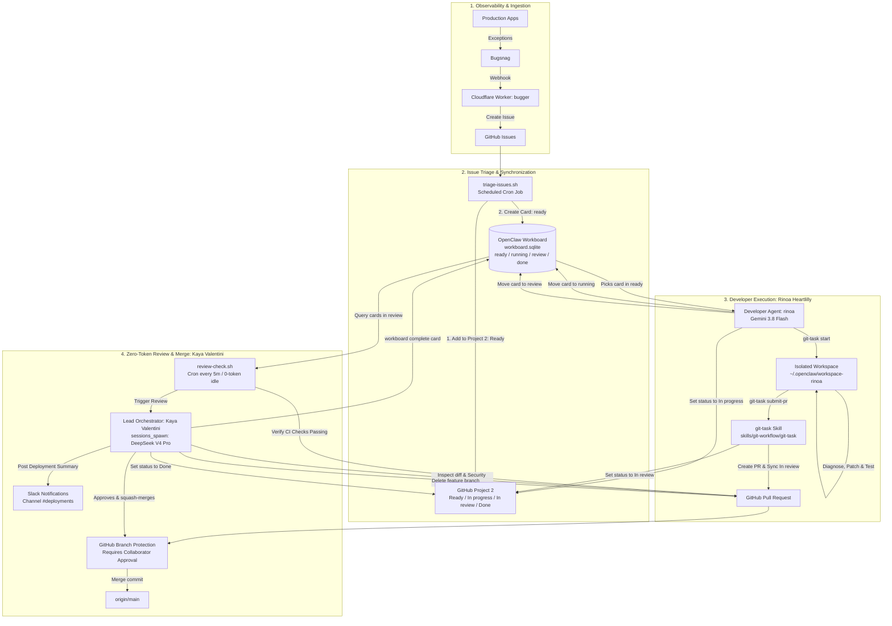
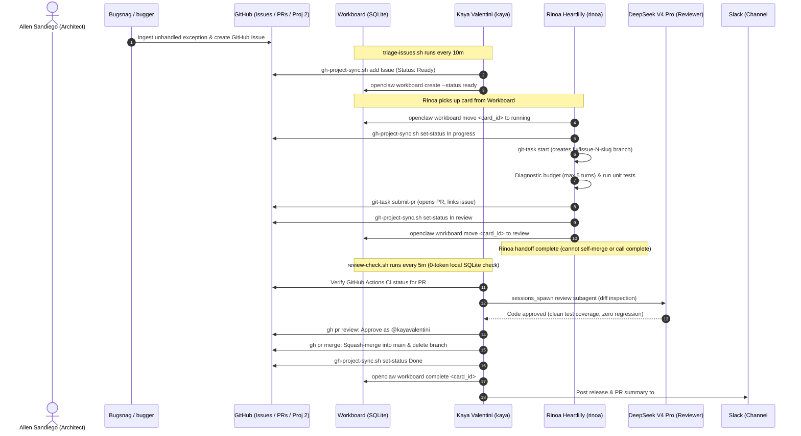

## 💡 The Autonomous Engineering Dream

In modern software operations, observability tools like **Bugsnag** capture exceptions the millisecond they occur in staging or production. Through webhooks and automation, these alerts are converted into **GitHub Issues**, complete with stack traces, breadcrumbs, and environment metadata.

Traditionally, that is where automation stalls. A human engineer must still:
1. Notice the ticket and manually prioritize it.
2. Clone the repository and check out a feature branch.
3. Diagnose the stack trace, reproduce the bug, and write tests.
4. Implement the fix and verify against test suites.
5. Push a branch and open a Pull Request.
6. Await peer review, address comments, squash-merge into `main`, and close the issue.

What if an autonomous AI agent engineering team handled steps 1 through 6 end-to-end—safely, reliably, and without burning through cloud API credits during idle periods?

Using **OpenClaw (v2026.9.4)** on our Proxmox homelab, we implemented an autonomous multi-agent engineering pipeline that orchestrates the entire lifecycle: from Bugsnag exception to tested, reviewed, and squash-merged Pull Request.

---

## 👥 The Multi-Agent Engineering Roster

A single monolithic agent attempting to triage, write code, run tests, and self-review inside a single prompt context quickly degrades: it suffers from context bloat, hallucinated commands, runaway API costs, and the dangerous temptation to push directly to production.

Instead, we organize our system around clear professional identities, strict separation of concerns, and least-privilege permissions:

| Identity | Agent Handle | Role & Title | Workspace Directory | Primary Engine / Hardware | Core Responsibilities |
| :--- | :--- | :--- | :--- | :--- | :--- |
| **Allen Sandiego** | `@allensandiego` | Product Owner & System Architect | Workstation / Git | Human-in-the-Loop | Architecture decisions, business requirements, homelab infrastructure, escalation authority. |
| **Kaya Valentini** | `kaya`<br/>``kaya.valentini`` | Chief of Staff & Lead Orchestrator | `~/.openclaw/workspace` | Local Qwen 3.5 2B (`llama.cpp` on GTX 1650) + DeepSeek V4 Pro | Issue triage, Project 2 management, PR code reviews, merge approvals, branch deletions, Slack alerts (`#deployments`). |
| **Rinoa Heartlilly** | `rinoa`<br/>``rinoa.heartlilly`` | Software Developer / Apprentice | `~/.openclaw/workspace-rinoa` | Google Gemini 3.8 Flash | Picks up `ready` cards, creates feature branches, diagnoses code, writes unit tests, submits PRs via `git-task`. |

---

## 🏗️ Architecture & End-to-End Pipeline

The system bridges local homelab compute, external SaaS observability, and frontier AI reasoning into a cohesive, secure loop:



---

## 🔄 End-to-End Sequence of an Autonomous Bug Fix

The entire lifecycle of a bug—from first exception to deployed fix—follows a deterministic handoff sequence:



---

## ⚡ Step 1: Hybrid Inference & Agent Topology

To keep operational expenses near zero while maintaining high intelligence, we run a hybrid model architecture:

### Local Inference: Debian Trixie LXC with GTX 1650
Routine cron jobs, issue discovery, heartbeat checks, and initial workspace routing run on our local homelab server. An NVIDIA GeForce GTX 1650 (4 GB VRAM) is passed through to a Proxmox LXC container running `llama.cpp`:

```bash
# llama-server service definition inside inference LXC
llama-server \
  -m /models/Qwen3.5-2B-GGUF.q4_0.gguf \
  --host 0.0.0.0 \
  --port 8080 \
  -c 65536 \
  --no-mmproj \
  --cache-type-k q8_0 \
  --cache-type-v q8_0 \
  -ngl 99
```

#### Key Flags Explained:
- `--no-mmproj`: Completely disables multimodal vision projector weights, freeing hundreds of megabytes of VRAM exclusively for context tokens.
- `--cache-type-k q8_0 --cache-type-v q8_0`: Quantizes the Key/Value cache to 8-bit precision instead of 16-bit float. This cuts KV cache memory footprint by 50% without degrading code syntax parsing.
- `-c 65536`: Extends context length to 64k tokens, allowing the local model to absorb large issue bodies and file trees without truncation.

### Agent Environment in `~/.openclaw/openclaw.json`

OpenClaw registers the two distinct agent workspaces and their role policies:

```json
{
  "agents": {
    "defaults": {
      "modelPolicy": {
        "allow": [
          "deepseek/deepseek-v4-pro",
          "google/gemini-3.8-flash",
          "llama/*"
        ]
      }
    },
    "entries": {
      "kaya": {
        "name": "kaya",
        "workspace": "/home/openclaw/.openclaw/workspace",
        "model": {
          "primary": "llama/Qwen3.5-2B-GGUF:Q4_0",
          "fallbacks": [
            "deepseek/deepseek-v4-pro",
            "google/gemini-3.8-flash"
          ]
        },
        "tools": {
          "alsoAllow": [
            "sessions_spawn",
            "sessions_yield",
            "subagents",
            "workboard_*"
          ]
        }
      },
      "rinoa": {
        "name": "rinoa",
        "workspace": "/home/openclaw/.openclaw/workspace-rinoa",
        "model": {
          "primary": "google/gemini-3.8-flash"
        },
        "tools": {
          "alsoAllow": [
            "workboard_list",
            "workboard_move"
          ],
          "deny": [
            "workboard_complete"
          ]
        }
      }
    }
  }
}
```

---

## 📋 Step 2: Workboard Lifecycle & GitHub Project 2 Sync

OpenClaw manages tasks locally through an embedded SQLite database (`~/.openclaw/workboard.sqlite`). Every engineering task advances through a strict state machine:

$$\text{ready} \longrightarrow \text{running} \longrightarrow \text{review} \longrightarrow \text{done} \quad (\text{or } \text{blocked})$$

### 1. The GitHub Project 2 Sync Utility (`gh-project-sync.sh`)
To keep external project tracking synchronized with internal agent state, we built `~/.openclaw/scripts/gh-project-sync.sh`:

```bash
#!/usr/bin/env bash
# ~/.openclaw/scripts/gh-project-sync.sh
set -euo pipefail

ACTION="${1:-}"
ITEM_REF="${2:-}"
STATUS_NAME="${3:-}"
PROJECT_NUM=2
OWNER="<owner>"

case "$ACTION" in
  add)
    # Add issue or PR to GitHub Project 2 and optionally set initial status
    ITEM_ID=$(gh project item-add "$PROJECT_NUM" --owner "$OWNER" --url "$ITEM_REF" --format json | jq -r '.id')
    if [ -n "$STATUS_NAME" ]; then
      gh project item-edit --id "$ITEM_ID" --project-id "$PROJECT_NUM" --field-id "Status" --text "$STATUS_NAME"
    fi
    echo "$ITEM_ID"
    ;;
  set-status)
    # Update status: "Ready", "In progress", "In review", or "Done"
    gh project item-edit --owner "$OWNER" --number "$PROJECT_NUM" --item-id "$ITEM_REF" --field-id "Status" --text "$STATUS_NAME"
    ;;
  *)
    echo "Usage: gh-project-sync.sh {add|set-status} <ref> [status]" >&2
    exit 1
    ;;
esac
```

### 2. Autonomous Issue Triage (`triage-issues.sh`)
A periodic cron automation queries GitHub for new issues labeled `bug` or generated via Bugsnag:

```bash
#!/usr/bin/env bash
# ~/.openclaw/scripts/triage-issues.sh
set -eo pipefail

PROJECT_OWNER="<owner>"
DB_PATH="$HOME/.openclaw/plugins/workboard/workboard.sqlite"

# Discover open issues across all repositories assigned for triage
ISSUES=$(gh search issues --owner="$PROJECT_OWNER" --assignee=kayavalentini --state=open --json number,title,repository,url 2>/dev/null || echo "[]")

echo "$ISSUES" | jq -c '.[]' | while IFS= read -r issue; do
  NUM=$(echo "$issue" | jq -r '.number')
  TITLE=$(echo "$issue" | jq -r '.title')
  REPO=$(echo "$issue" | jq -r '.repository.nameWithOwner')
  URL=$(echo "$issue" | jq -r '.url')

  # Check if Workboard already tracks this issue
  EXISTS=$(sqlite3 "$DB_PATH" "SELECT id FROM workboard_cards WHERE notes LIKE '%$URL%' OR title LIKE '%$REPO#$NUM%';" 2>/dev/null)
  
  if [ -z "$EXISTS" ]; then
    # 1. Reassign triage mailbox to developer agent
    gh issue edit "$NUM" --repo "$REPO" --remove-assignee kayavalentini --add-assignee rinoaheartlilly >/dev/null 2>&1 || true

    # 2. Create card in Workboard (status: ready, assigned to rinoa)
    openclaw workboard create --agent rinoa --status ready --notes "$URL" "$REPO#$NUM: $TITLE"

    # 3. Sync to GitHub Project 2 (Status: Ready)
    ~/.openclaw/scripts/gh-project-sync.sh add "$URL" "Ready"
  fi
done
```

---

## 🛠️ Step 3: Developer Guardrails & Atomic Git Workflows

Autonomous coding agents left unchecked will run into failure modes: micro-stepping across dozens of one-line shell calls, burning rate limits (HTTP 429), or falling into infinite diagnostic rabbit holes.

In Rinoa's development workspace (`~/.openclaw/workspace-rinoa`), we enforce strict **Operational Guardrails**:

### The Four Operational Guardrails
1. **Command Batching (Anti-Micro-Stepping):**
   Agents are instructed to batch related operations into coherent compound scripts (e.g., `cd repo && mvn clean test -Dtest=SuiteTest && git status`) rather than executing single commands across separate conversational turns.
2. **5-Turn Diagnostic Budget:**
   Rinoa is given a hard budget of 5 turns to locate the bug and formulate a fix. If the test suite does not pass within 5 iterations, she must flag the card as `blocked`, document the findings, and alert Kaya. This prevents token runaway and 429 quota exhaustion.
3. **Local Search Over Remote Curls:**
   Network calls to fetch remote documentation or web packages are restricted. Rinoa must query the local codebase using `grep`, `ripgrep`, or language server indexes already cached in the workspace.
4. **Zero Binary Downloads:**
   Arbitrary `curl | sh` or binary executable fetching is prohibited in the agent sandbox.

### Atomic Git Hygiene with `skills/git-workflow/git-task`

To prevent git tree corruptions, Rinoa interacts with Git exclusively through the `git-task` skill:

#### 1. Checking Out a Task (`git-task start`)
```bash
# Rinoa picks up the card, moves status to running, and creates the branch
openclaw workboard move <card_id> --status running
~/.openclaw/scripts/gh-project-sync.sh set-status "<issue_url>" "In progress"

git-task start --repo <owner>/<repo> --issue <N> --name "<short-slug>"
```
Behind the scenes, `git-task`:
- Synchronizes with the latest remote `origin/main`.
- Creates and checks out a feature branch: `fix/issue-<N>-<short-slug>`.

#### 2. Atomic PR Submission (`git-task submit-pr`)
Once the fix is implemented and local unit tests pass:
```bash
git-task submit-pr \
  --repo <owner>/<repo> \
  --issue <N> \
  --title "fix: <concise description of the fix>" \
  --summary "<bullet points of changes made>" \
  --verify "<test results and verification notes>"
```

In a single atomic step, `git-task submit-pr`:
1. Formats commits following Conventional Commits syntax (`fix: ... Resolves #<N>`).
2. Pushes the branch `fix/issue-<N>-<short-slug>` to `origin`.
3. Opens a Pull Request against `main` via `gh pr create`.
4. Links PR to GitHub Issue `#<N>`.
5. Automatically invokes `gh-project-sync.sh set-status "<issue_url>" "In review"`.

#### 3. Strict Handoff Protocol
Rinoa marks her work complete by handing the card off:
```bash
openclaw workboard move <card_id> --status review
```
> [!IMPORTANT]
> **Rinoa is strictly forbidden from self-merging PRs or calling `workboard_complete` directly on PR tasks.** Her role terminates as soon as the card enters `review`. Only the lead orchestrator, Kaya Valentini, can approve, squash-merge, and close the card.

---

## 🛡️ Step 4: Branch Protection: Eliminating Rogue Self-Merges

A common anxiety with AI coding agents is the risk of an agent hallucinating permissions and running `gh pr merge --admin` directly into production.

In our repository architecture, we enforce **GitHub Repository Branch Protection Rules** at the API layer:

```text
Repository: <owner>/<repo>
Protected Branch: main
├── Require a pull request before merging: ENABLED
│   ├── Require approvals: 1
│   ├── Dismiss stale pull request approvals when new commits are pushed: ENABLED
│   └── Require review from Code Owners: ENABLED
├── Require status checks to pass before merging: ENABLED
│   └── Status checks: <your CI check names>
├── Do not allow bypassing the above settings: ENABLED
└── Restrict who can push to matching branches: Kaya Valentini (@kayavalentini)
```

### Why Rinoa Cannot Rogue-Merge
- **Cryptographic & Role Segregation:** Rinoa's credentials (`rinoa.heartlilly`) hold contributor rights. GitHub explicitly blocks authors from approving their own PRs.
- **Enforced 403 Forbidden:** Even if Rinoa executes `gh pr merge --squash`, GitHub's API rejects the call:
  ```json
  {
    "message": "Pull Request is not mergeable: At least 1 approving review is required.",
    "documentation_url": "https://docs.github.com/rest/pulls/pulls#merge-a-pull-request"
  }
  ```
- **Collaborator Signature:** Only Kaya Valentini (`@kayavalentini`), operating with Chief of Staff collaborator permissions, can submit the approving review.

---

## 💰 Step 5: The Zero-Token Review Monitor (`review-check.sh`)

If an orchestrator agent polls a frontier model like DeepSeek V4 Pro or Claude every 5 minutes to ask *"Are there any PRs to review?"*, it wakes up **288 times a day**. Even when the queue is completely empty, context ingestion costs would burn through API budgets.

Instead, we decouple monitoring from model inference using a local shell automation:

```bash
#!/usr/bin/env bash
# ~/.openclaw/scripts/review-check.sh
set -eo pipefail
export PATH="/home/openclaw/.nvm/versions/node/v24.18.0/bin:/usr/local/bin:$PATH"

# 1. Fast, free query of local SQLite workboard (~10ms execution, $0.00 cost)
CARDS_JSON=$(openclaw workboard list --status review --json 2>/dev/null || echo '{"cards":[]}')
COUNT=$(echo "$CARDS_JSON" | jq '.cards | length' 2>/dev/null || echo 0)

if [ "$COUNT" -eq 0 ]; then
  # Workboard queue empty. Exit immediately without waking any LLM.
  exit 0
fi

# 2. For each card in review, extract its PR metadata and check CI
for ROW in $(echo "$CARDS_JSON" | jq -r '.cards[] | @base64'); do
  _jq() { echo "$ROW" | base64 --decode | jq -r "$1"; }
  CARD_ID=$(_jq '.id')
  NOTES=$(_jq '.notes')

  # Resolve repo and PR from card notes (stored as the issue URL)
  REPO=$(echo "$NOTES" | sed -E 's|https://github.com/([^/]+/[^/]+)/.*|\1|')
  PR_NUM=$(gh pr list --repo "$REPO" --state open --json number,headRefName \
    --jq '.[] | select(.headRefName | startswith("fix/")) | .number' | head -n 1)

  # 3. Check GitHub Actions CI check status
  CI_STATUS=$(gh pr checks "$PR_NUM" --repo "$REPO" --json state \
    --jq '.[].state' 2>/dev/null | sort -u || echo "PENDING")

  if echo "$CI_STATUS" | grep -q "PENDING"; then
    exit 0  # CI still running, retry on next cycle
  fi

  if echo "$CI_STATUS" | grep -q "FAILURE"; then
    # CI failed. Move card to blocked and alert developer agent.
    openclaw workboard move "$CARD_ID" --status blocked
    openclaw message send --to rinoa --message "CI failed for PR #$PR_NUM in $REPO. Check test logs."
    exit 0
  fi

  # 4. CI passed! Only now do we invoke Kaya to perform frontier code review.
  openclaw agent --agent kaya --message "Review Trigger: Card $CARD_ID for $REPO (PR #$PR_NUM) is ready for Senior Review. CI checks passed. Inspect PR diff using sessions_spawn with model 'deepseek/deepseek-v4-pro', approve as @kayavalentini, squash-merge, mark Project 2 'Done', complete card, and alert Slack channel #deployments."
done
```

We register this script with OpenClaw's recurring scheduler:
```bash
openclaw automations add \
  --name "Workboard Review Monitor" \
  --every 5m \
  --no-deliver \
  --command "sh -lc ~/.openclaw/scripts/review-check.sh"
```

- **98% of the day (Idle):** The shell script queries local SQLite in ~10 milliseconds and exits cleanly. **Tokens consumed = 0. Cost = $0.00.**
- **When a PR arrives and CI passes:** It fires **exactly once**, spawning a frontier review session.

---

## 🔍 Step 6: Frontier Review, Merge, & Slack Broadcast

Once woken by `review-check.sh`, Kaya Valentini delegates the code inspection to a frontier subagent session using **DeepSeek V4 Pro**:

```json
{
  "task": "Review Pull Request #<PR_NUM> on <owner>/<repo>:\n1. Run: gh pr diff <PR_NUM> --repo <owner>/<repo>\n2. Validate logic against regression, platform compatibility, and test coverage.\n3. If valid:\n   - gh pr review <PR_NUM> --repo <owner>/<repo> --approve -b 'LGTM: verified by @kayavalentini.'\n   - gh pr merge <PR_NUM> --repo <owner>/<repo> --squash --delete-branch\n   - ~/.openclaw/scripts/gh-project-sync.sh set-status '<issue_url>' 'Done'\n   - openclaw workboard complete <card_id>\n   - Post release summary to Slack channel #deployments.",
  "model": "deepseek/deepseek-v4-pro",
  "label": "PR Review #<PR_NUM>"
}
```

### DeepSeek V4 Pro Review Criteria
The review prompt focuses on engineering correctness:
1. **Regression Analysis:** Does the fix introduce unexpected side effects in neighboring modules?
2. **Test Completeness:** Are edge cases covered with assertions, or did the developer merely silence an exception?
3. **Clean Diffs:** No formatting noise, accidental `.env` leaks, or extraneous dependency bumps.

### Autonomous Squash & Slack Notification
When DeepSeek approves the diff:
1. Kaya approves the PR on GitHub as `@kayavalentini`.
2. The PR is squash-merged, and the temporary feature branch `fix/issue-<N>-<slug>` is deleted from GitHub.
3. The GitHub Project 2 card status updates to **Done**.
4. The Workboard card transitions to **done** in `workboard.sqlite`.
5. An automated deployment payload lands in Slack channel **`#deployments`**:

```text
🚀 Autonomous Fix Merged & Deployed
• Repo: <owner>/<repo> (PR #<PR_NUM>)
• Issue: #<N> "<issue title>"
• Author: Rinoa Heartlilly (@rinoaheartlilly)
• Reviewer: Kaya Valentini (@kayavalentini)
• Commit: <sha> "<conventional commit message> (#<PR_NUM>)"
• Tests: CI All checks green
• Status: GitHub Project 2 -> Done | Workboard -> Completed
```

---


## 📊 Performance & Cost Accounting

Here is the operational breakdown across a typical 24-hour cycle handling 5 production bug fixes:

| Workflow Stage | Execution Frequency | Engine / Model | Daily API Cost |
| :--- | :---: | :--- | :---: |
| **GitHub Issue Scanning & Triage** | 144 runs/day (every 10m) | Local Qwen 3.5 2B (GTX 1650) | **$0.00** |
| **Workboard Idle Polling** | 288 runs/day (every 5m) | Local Bash & SQLite (`workboard.sqlite`) | **$0.00** |
| **Bug Investigation & Unit Tests** | 5 tasks | Google Gemini 3.8 Flash | **~$0.05** |
| **DeepSeek Frontier Review** | 5 reviews | DeepSeek V4 Pro | **~$0.08** |
| **Project & Slack Webhook Sync** | Continuous | GitHub CLI & curl | **$0.00** |
| **Total 24-Hour Autonomous Cost** | — | — | **~$0.13 / day** |

---

## 💡 Key Architectural Takeaways

1. **Role Specialization is Safety:**
   Separating **Chief of Staff (Kaya)** from **Developer Apprentice (Rinoa)** enforces accountability. Rinoa cannot self-merge or close cards; Kaya orchestrates and reviews.
2. **Zero-Token Polling Saves Budgets:**
   Never poll queues or watch PRs using paid LLMs. Use deterministic shell scripts against local SQLite databases to trigger model inference strictly on actionable state changes.
3. **Local GPUs Handle the High-Frequency Noise:**
   Running Qwen 3.5 2B on a modest GTX 1650 provides free, 24/7 background intelligence for cron and triage tasks, preserving cloud budget for high-reasoning code analysis and reviews.
